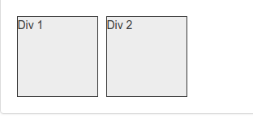
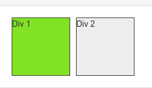
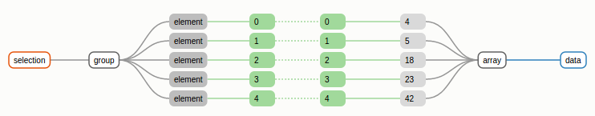

D3.js es una biblioteca JavaScript diseñada para la creación de visualizaciones interactivas utilizando tecnologías como HTML, CSS y SVG.

En general es una herramienta flexible capaz de permitirnos transformar el contenido de una página para representar visualmente información existente en JavaScript. Pero, ¿cómo funciona?

## Selectores y propiedades

Primero que nada, se encuentran los métodos `select()` y `selectAll()` que nos permiten, como su nombre lo indica, seleccionar elementos (nodos) del _DOM_ (Document Object Model) que compone nuestra página. Existen varios tipos de selectores que podemos utilizar.

- **Elemento:** Permite seleccionar el o los elementos que concuerden con el tipo de etiqueta

  ```javascript
  d3.select("div");
  d3.selectAll("p");
  d3.selectAll("svg circle");
  ```

- **Clase:** Todos los elementos que concuerden con un nombre de clase

  ```javascript
  d3.select(".dropdown");
  d3.selectAll(".card-content");
  d3.selectAll(".square");
  ```

- **Id:** Permite seleccionar el elemento que tiene ese id único

  ```javascript
  d3.select("#main-chapter");
  ```

Estos métodos nos permiten seleccionar elementos con una ligera diferencia: _select_ obtiene el **PRIMER** elemento que encuentra, mientras que _selectAll_ devuelve en la selección todos los elementos que empaten con el selector.

Ahora, a esta selección podemos cambiarle sus propiedades, esto va a depender del tipo de elemento que sea. No es lo mismo cambiar una propiedad de color de fuente a un párrafo que la posición _(x,y)_ del centro de un círculo en un SVG.

Para esto, d3 nos provee de dos metodos principales `.attr()`y `.style()`. El primero nos permite obtener o cambiar un atributo del elemento y el segundo nos permite modificar los estilos CSS.



```javascript
// Cambiar el color de fondo de un div (CSS)
d3.selectAll("div.square").style("background-color", "yellowgreen");

// Actualizar el ancho de un rectángulo
d3.select("svg rect").attr("width", 150);
```



## Datos, el ❤ de D3.js

Ok, ya vimos que podemos seleccionar elementos y cambiar sus propiedades, pero esto toma mucho más sentido cuando los datos entran en acción. D3 nos permite vincular datos que se encuentren en nuestro código a elementos del DOM.

Esto se logra a través del metodo `.data()` que por default crea un enlace _uno a uno_ con los elementos existentes.



Así, si existen 5 elementos en nuestra selección y tenemos 5 datos en una variable, los enlazará a cada uno. A esta selección por default se le llama subselección _update_.

==¿Pero qué pasa si tenemos menos elementos o menos datos?==

Para estos casos existen las **subselecciones**.

Si después de enlazar con _data()_ utilizamos el método `.enter()`, esta subselección nos devolverá **todos los datos que no encontraron elemento con el cuál enlazarse**, los datos nuevos que aún no se ven reflejados en la página.

Ahora bien, si después de usar el método _data()_ usamos `.exit()`, esta subselección nos devolverá **los elementos existentes en el DOM a los que no pudo asignar un dato**, este tiene su funcionalidad para hacer algo con aquellos elementos sobrantes que ya no representan nuestros datos.

Una vez que se tiene una selección donde fueron enlazados datos, entonces ya es posible utilizar estos para representarlos visualmente en cada uno de los elementos. Por ejemplo:

### Crear elementos para datos nuevos

```javascript
var allData = ["A", "B", "C", "D"]; // Arreglo de datos
d3.selectAll(".square") // Intentamos seleccionar los .square
  .data(allData) // Se enlaza con los 4 datos
  .enter() // Para todos los datos nuevos
  .append("div") // Crea un nuevo div para cada uno
  .attr("class", "square"); // Asigna la clase square
```

En este caso se está creando un _-div_ para cada uno de mis datos que previamente no existían en la página, y todos tendrán la misma clase _square_. Si se quiere que cada elemento tenga asignado un valor que corresponda a lo existente en los datos, es necesario pasarle como segundo parámetro un _callback_ que modifique el resultado para cada elemento.

```javascript
var sizes = [100, 150, 230];
d3.selectAll("circle").attr("r", function(d) {
  return d; // Cada uno de los datos se representa en el valor del radio
});
```
